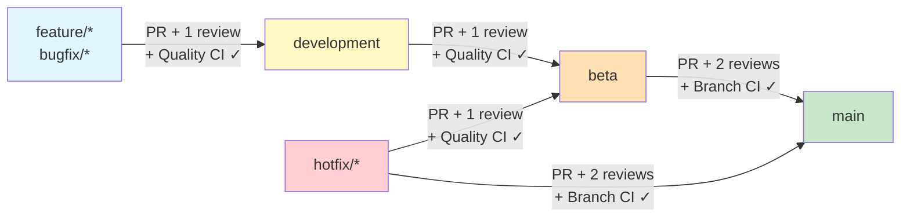

# Contributing to Conduction Nextcloud Apps

Thank you for considering contributing to our projects! It's people like you that make open source such a great community.

## Code of Conduct

This project and everyone participating in it is governed by our [Code of Conduct](CODE_OF_CONDUCT.md). By participating, you are expected to uphold this code.

## How Can I Contribute?

### Reporting Bugs

Before creating bug reports, please check the issue list as you might find out that you don't need to create one. When you are creating a bug report, please include as many details as possible:

- Use a clear and descriptive title
- Describe the exact steps which reproduce the problem
- Provide specific examples to demonstrate the steps
- Describe the behavior you observed after following the steps
- Explain which behavior you expected to see instead and why
- Include screenshots if possible

### Suggesting Enhancements

Enhancement suggestions are tracked as GitHub issues. When creating an enhancement suggestion, please include:

- Use a clear and descriptive title
- Provide a step-by-step description of the suggested enhancement
- Describe the current behavior and explain which behavior you expected to see instead
- Explain why this enhancement would be useful

### Pull Requests

- Fork the repo and create your branch from `development`
- If you've added code that should be tested, add tests
- If you've changed APIs, update the documentation
- Ensure the test suite passes
- Make sure your code lints (`composer cs:check`)
- Create a pull request!

### PR Size

Prefer **one PR per logically-coherent finding or feature**. Each PR's commit message, checkbox, and inline-comment chain should map to a single change unit — reviewers hold a clearer mental model on focused PRs than on large ones.

- When a PR's scope grows past **~10 commits or ~30 files**, consider splitting it before requesting review. The per-finding commits stay; the PR boundary moves.
- **Exception:** release-promotion PRs (`development → beta`, `beta → main`) aggregate every change since the last cut and are expected to be larger.
- PRs touching many files across unrelated subsystems tend to get reviewed paragraph-by-paragraph rather than holistically — that's a signal to split, not to push through.

## Branch Protection & Git Flow

We use a structured branching model to ensure stability across environments. All branches are protected via **organization-wide rulesets** on the ConductionNL GitHub organization — direct pushes are not allowed. Every change flows through a pull request with peer review and CI checks.



### Branch Rules

These rules are enforced organization-wide across all ConductionNL repositories. They cannot be overridden at the repository level.

| Target        | Allowed Sources                              | Reviews             | Required CI Checks                                  |
| ------------- | -------------------------------------------- | ------------------- | --------------------------------------------------- |
| `development` | `feature/*`, `bugfix/*`                      | 1 approving review  | Quality CI (`lint-check`)                           |
| `beta`        | `development`, `hotfix/*`, `main` (backport) | 1 approving review  | Quality CI (`lint-check`)                           |
| `main`        | `beta`, `hotfix/*`                           | 2 approving reviews | Branch Protection CI (`check-branch`, `lint-check`) |

### Organization-Wide Rulesets

Branch protection is managed at the **organization level**, not per-repository. This ensures consistent enforcement across all Conduction apps. The three rulesets are:

1. **Development Branch Protection** — Enforces peer review and Quality CI for all feature work entering `development`
2. **Beta Branch Protection** — Same requirements as development, gates the path to beta releases
3. **Main Branch Protection** — Stricter: requires 2 reviewers and branch-source validation before stable release

All rulesets also enforce:

- No force pushes
- No branch deletion
- Stale reviews dismissed on new pushes
- All review threads must be resolved before merge

### How It Works

1. **Feature work** happens on `feature/*` or `bugfix/*` branches created from `development`
2. **PRs to `development`** require 1 approving peer review and the Quality CI workflow must pass
3. **When ready for beta release**, a developer creates a PR from `development` to `beta` — same review + CI requirements
4. **Merging to `beta`** triggers an automatic beta release to the Nextcloud App Store
5. **When ready for stable release**, a developer creates a PR from `beta` to `main` — requires 2 approving reviews and Branch Protection CI
6. **Merging to `main`** triggers an automatic stable release to the Nextcloud App Store
7. **Hotfixes** can target both `beta` and `main` directly for urgent patches via PR (same review requirements apply)
8. **Branches are automatically deleted** after their PR is merged

> **Important:** There are no automatic merges or auto-created PRs between branches. Every promotion (development -> beta -> main) requires a deliberate pull request created by a developer, with peer review and CI passing before merge is allowed.

## Quality Workflow

Every pull request triggers our automated quality pipeline. **All checks must pass before a PR can be merged.** This ensures that no code enters `development`, `beta`, or `main` without meeting our quality standards.

### PHP Quality Checks

| Check               | Tool              | What It Does                                           |
| ------------------- | ----------------- | ------------------------------------------------------ |
| **Lint**            | `php -l`          | Syntax validation — catches parse errors               |
| **Code Style**      | PHPCS             | Enforces coding standards (PSR-12 + custom rules)      |
| **Static Analysis** | PHPStan (level 5) | Type checking, undefined methods, dead code            |
| **Static Analysis** | Psalm             | Additional type inference and security analysis        |
| **Mess Detection**  | PHPMD             | Complexity, naming, unused code, design problems       |
| **Metrics**         | phpmetrics        | Maintainability index, coupling, cyclomatic complexity |

### Frontend Quality Checks

| Check          | Tool      | What It Does                       |
| -------------- | --------- | ---------------------------------- |
| **JavaScript** | ESLint    | Enforces JS/Vue coding standards   |
| **CSS**        | Stylelint | Enforces CSS/SCSS coding standards |

### Dependency Checks

| Check                         | What It Does                                               |
| ----------------------------- | ---------------------------------------------------------- |
| **License (npm + composer)**  | Ensures all dependencies use approved open-source licenses |
| **Security (npm + composer)** | Checks for known vulnerabilities in dependencies           |

### Running Quality Checks Locally

```bash
# PHP
composer cs:check          # PHPCS code style
composer cs:fix            # Auto-fix code style
composer phpstan           # PHPStan static analysis
composer psalm             # Psalm static analysis
composer phpmd             # PHPMD mess detection

# Frontend
npm run lint               # ESLint
npx stylelint "src/**/*.{css,scss,vue}"  # Stylelint
```

## App Store Release Process

Releases to the Nextcloud App Store are fully automated via GitHub Actions. They are triggered by merging PRs into `beta` or `main`. Version numbers are calculated automatically from PR labels.

```mermaid
graph TD
    subgraph "Beta Release"
        D[development] -->|"Developer creates PR"| BP1{"Quality CI\npasses?"}
        BP1 -->|"Yes"| BM["Merge PR to beta"]
        BP1 -->|"No"| BF["Fix issues\nre-push"]
        BF --> BP1
        BM --> BT{Version Bump\nfrom PR label}
        BT -->|"label: major"| BV1["v2.0.0-beta.20260319"]
        BT -->|"label: minor"| BV2["v1.1.0-beta.20260319"]
        BT -->|"label: patch\n(default)"| BV3["v1.0.1-beta.20260319"]
        BV1 & BV2 & BV3 --> BB["Build & Package"]
        BB --> BU["Upload to App Store\n(nightly channel)"]
        BB --> BG["Create GitHub\npre-release"]
    end

    subgraph "Stable Release"
        B2[beta] -->|"Developer creates PR"| SP1{"Branch Protection\nCI passes?"}
        SP1 -->|"Yes"| SM["Merge PR to main"]
        SP1 -->|"No"| SF["Fix issues"]
        SF --> SP1
        SM --> ST{Version Bump\nfrom PR label}
        ST -->|"from PR labels"| SV["v1.1.0"]
        SV --> SB["Build & Package"]
        SB --> SU["Upload to App Store\n(stable channel)"]
        SB --> SG["Create GitHub release\nwith changelog"]
    end

    style D fill:#fff9c4
    style BM fill:#ffe0b2
    style SM fill:#c8e6c9
    style BU fill:#e1bee7
    style SU fill:#e1bee7
    style BF fill:#ffcdd2
    style SF fill:#ffcdd2
```



### Version Labeling

Add a label to your PR to control the version bump:

| Label             | Version Change    | When to Use                          |
| ----------------- | ----------------- | ------------------------------------ |
| `major`           | `1.0.0` → `2.0.0` | Breaking changes, major redesigns    |
| `minor`           | `1.0.0` → `1.1.0` | New features, non-breaking additions |
| `patch` (default) | `1.0.0` → `1.0.1` | Bug fixes, small improvements        |

### Release Artifacts

Each release automatically:

1. Bumps the version in `appinfo/info.xml`
2. Builds the app (composer install, npm build)
3. Creates a signed tarball
4. Uploads to the [Nextcloud App Store](https://apps.nextcloud.com)
5. Creates a GitHub release with auto-generated changelog

## Documentation Release Process

Documentation is built with [Docusaurus](https://docusaurus.io/) and deployed to GitHub Pages.

1. Documentation source lives in the `docs/` (or `docusaurus/`) folder on any branch
2. Push or merge to the `documentation` branch triggers the build
3. Docusaurus builds the static site
4. The site is deployed to GitHub Pages with a custom domain (e.g., `openregister.app`)

Each app has its own documentation site — see the app's README for its URL.

## Development Process

1. Create a feature request issue describing your proposed changes
2. Fork the repository
3. Create a new branch: `git checkout -b feature/[issue-number]/[feature-name]`
4. Make your changes
5. Run quality checks: `composer cs:check` and `composer phpstan`
6. Push to your fork and open a Pull Request
7. Wait for Quality CI to pass, address any failures
8. Request review from a team member

### Git Commit Messages

We use [Conventional Commits](https://www.conventionalcommits.org/en/v1.0.0/):

- `feat:` for new features
- `fix:` for bug fixes
- `chore:` for maintenance tasks
- `docs:` for documentation changes
- `refactor:` for code refactoring
- Use the present tense and imperative mood
- Limit the first line to 72 characters

### PR Labels for Changelogs

Add labels to categorize your PR in the automated changelog:

- **`feature`** / **`enhancement`** — New features (appears under "Added")
- **`bug`** / **`fix`** — Bug fixes (appears under "Fixed")
- **`docs`** — Documentation updates
- **`refactor`** / **`chore`** — Code improvements (appears under "Changed")
- **`skip-changelog`** — Exclude from changelog

## Development Setup

1. Install PHP 8.1+ and Node.js 20+
2. Install Composer
3. Clone the repository
4. Run `composer install` and `npm install`
5. Configure your [Nextcloud development environment](https://github.com/ConductionNL/nextcloud-docker-dev)

## Community

- Join the [Common Ground Slack](https://commonground.nl)
- Follow us on [X](https://x.com/conduction_nl)
- Read our updates on [LinkedIn](https://www.linkedin.com/company/conduction/)

## License

By contributing, you agree that your contributions will be licensed under the same license as the project (EUPL-1.2 unless stated otherwise).
